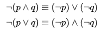

# Week10
## 迪摩根定理(De Morgan's laws)
* 在命題邏輯和邏輯代數中，德摩根定律是關於命題邏輯規律的一對法則。
 

# 圖片出處:[迪摩根定理](https://zh.wikipedia.org/wiki/%E5%BE%B7%E6%91%A9%E6%A0%B9%E5%AE%9A%E5%BE%8B)

## 謂詞邏輯
* 在布林邏輯中，只有用來代表真假值的簡單變數，像是 A, B, C, X, Y, Z .... 等，所以邏輯算式看來通常如下：
* P & (P=>Q) => Q.
* A & B & C => D | E.
* -(A & B) <=> -A | -B.
* 這種命題邏輯裏沒有函數的概念，只有簡單的命題 (Proposition)，因此才稱為命題邏輯。

* 而在謂詞邏輯裏，則有「布林函數」的概念，因此其表達能力較強，例如以下是一些謂詞邏輯的範例。

* Parent(x,y) <= Father(x,y).
* Parent(John, Johnson).
* Ancestor(x,y) <= Parent(x,y).
* Ancestor(x,y) <= Ancestor(x,z) & Parent(z,y).
* 您可以看到在這種邏輯系統裏，有「布林變數」的概念 (像是 x, y, z 等等)，也有函數的概念，像是 Parent(), Father(), Ancestor() 等等。

## 一階邏輯
* 在上述這種謂詞邏輯系統中，如果我們加上  (對於所有) 或  (存在) 這兩個變數限定符號，而其中的謂詞不可以是變項，而必須要是常項，這種邏輯就稱為一階邏輯。

* 當然、規則可以更複雜，像是以下這個範例，就說明了「存在一些人可以永遠被欺騙」。

## 二階邏輯
* 如果一階邏輯中的謂詞，放寬成可以是變項的話 (這些變項可以加上  與  等符號的約束)，那就變成了二階邏輯，以下是一些二階邏輯的規則範例。

# 內容取自:[謂詞邏輯](https://programmermagazine.github.io/201403/htm/focus3.html)

## [Prolog 語言入門教程](https://www.ruanyifeng.com/blog/2019/01/prolog.html)

# 內容補充
 
