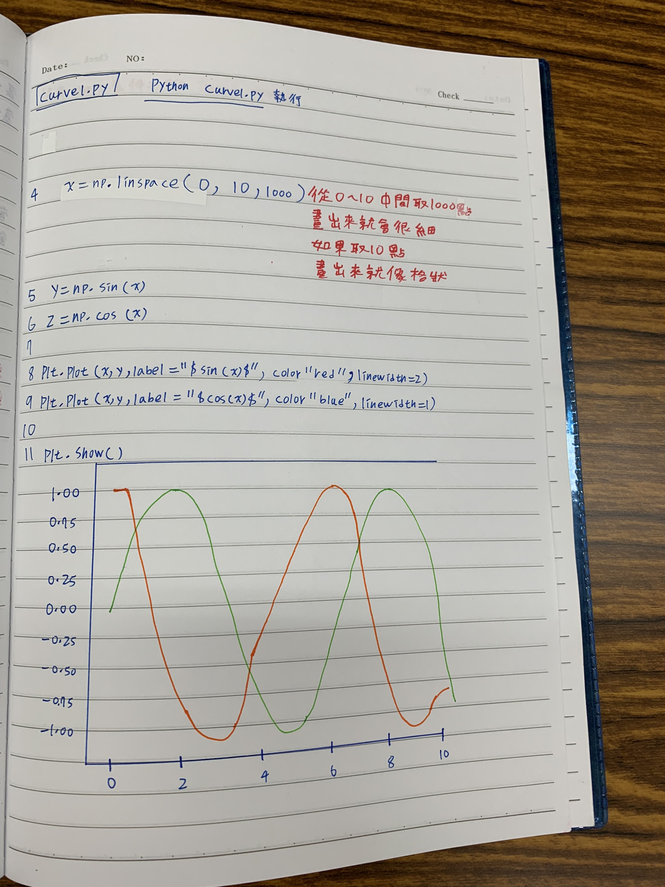
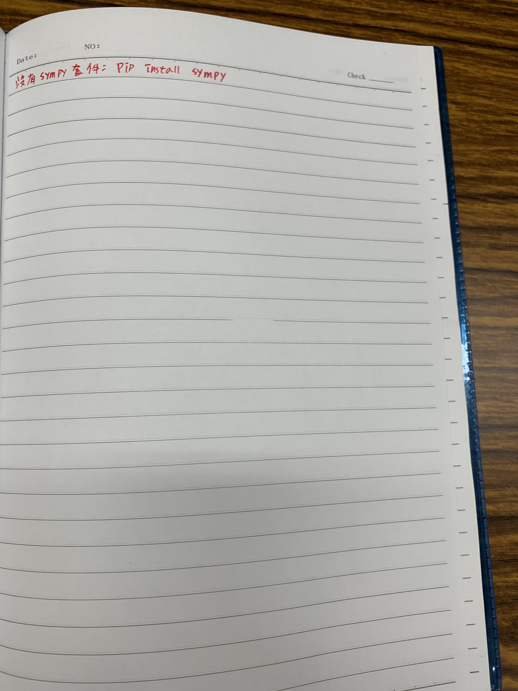

# Week11
## 傅立葉分析
* 是數學的一個分支領域。它研究如何將一個函數或者信號表達為基本波形的疊加。它研究並擴展傅立葉級數和傅立葉變換的概念。基本波形稱為調和函數，調和分析因此得名。在過去兩個世紀中，它已成為一個廣泛的主題，並在諸多領域得到廣泛應用，如信號處理、量子力學、神經科學等。
* 定義於Rn上的經典傅立葉變換仍然是一個十分活躍的研究領域，特別是在作用於更一般的對象（例如緩增廣義函數）上的傅立葉變換。例如，如果在函數或者信號上加上一個分布f，我們可以試圖用f的傅立葉變換來表達這些要求。Paley-Wiener定理就是這樣的一個例子。Paley-Wiener定理直接蘊涵如果f是緊支撐的一個非零分布，（這包含緊支撐函數），則其傅立葉變換從不擁有緊支撐。這是在調和分析下的測不準原理的一個非常初等的形式。參看經典調和分析。
* 在希爾伯特空間，傅立葉級數的研究變得很方便，該空間將調和分析和泛函分析聯繫起來。
# 內容出處:[傅立葉分析](https://zh.wikipedia.org/wiki/%E5%82%85%E9%87%8C%E5%8F%B6%E5%88%86%E6%9E%90)
# [傅立葉分析之掐死教程](https://zhuanlan.zhihu.com/p/19763358?fbclid=IwAR2jVP63mr4--sW1ZFbK2mjyZ_c2qY8SolV39nB-3udBWpQlVV0SnvmbFtE)

# 內容補充:

 
