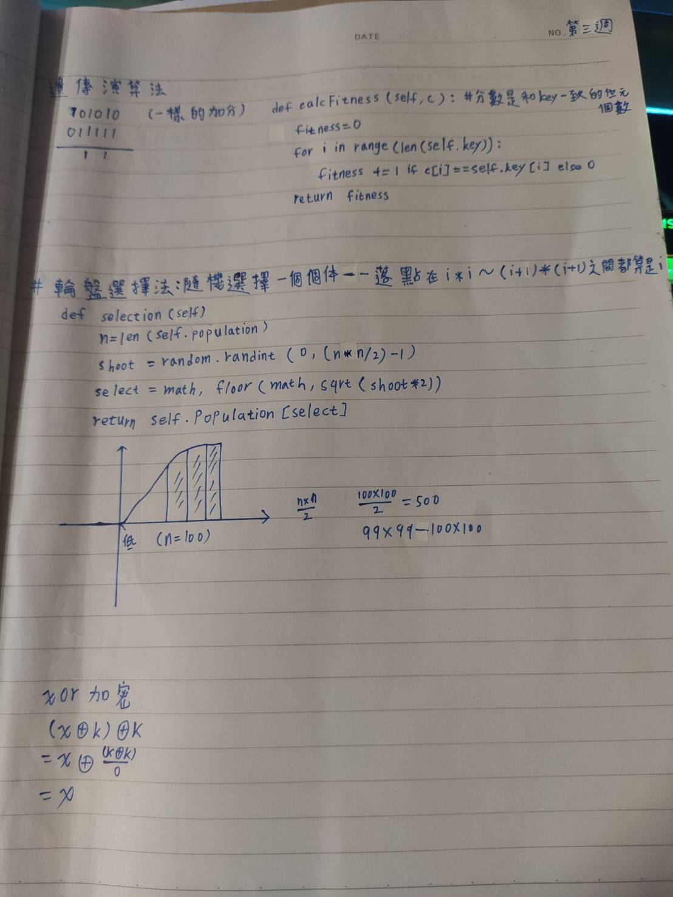

# Week4
## 線性規劃
### 在數學中，線性規劃特指目標函數和約束條件皆為線性的最佳化問題。
### 標準型
* 描述線性規劃問題的常用和最直觀形式是標準型。標準型包括以下三個部分：
* (1)一個需要極大化的線性函數
* (2)以下形式的問題約束
* (3)和非負變量
### 增廣矩陣（鬆弛型）
* 在用單純型法求解線性規劃問題之前，必須先把線性規劃問題轉換成增廣矩陣形式。增廣矩陣形式引入非負鬆弛變量將不等式約束變成等式約束。
### 對偶
* 每個線性規劃問題，稱為原問題，都可以變換為一個對偶問題。
## 整數規劃
* 一個整數規劃問題是一個數學優化或可行性方案，其中一些或所有的變量都限制為整數。在許多設置中，該術語指的是整數線性規劃(ILP)，其中目標函數和約束（整數約束除外）是線性的。整數規劃是NP 完全的。特別是 0-1 整數線性規劃的特殊情況，其中未知數是二進制的，並且只需要滿足限制條件，是Karp 的 21 個 NP-完全問題之一。如果某些決策變量不是離散的，則該問題稱為混合整數規劃問題。
## 深度優先搜尋法
* 是一種用來遍尋一個樹或圖的演算法。由樹的根來開始探尋，先探尋邊上未搜尋的一節點，並儘可能深的搜索，直到該節點的所有邊上節點都已探尋；就回溯到前一個節點，重覆探尋未搜尋的節點，直到找到目 的節點或遍尋全部節點。
## 廣度優先搜尋法
* 是一種圖形搜索演算法。從圖的某一節點開始走訪，接著走訪此一節點所有相鄰且未拜訪過的節點，由走訪過的節點繼續進行先廣後深的搜尋。以樹來說即把同一深度的節點走訪完，再繼續向下一個深度搜尋，直到找到目的節點或遍尋全部節點。
# 內容補充
 

# [本周習題:請用搜尋法（深度優先）求解八個皇后問題。](https://github.com/weng0418/ai109b/blob/main/homework/work2/HW2.md)

