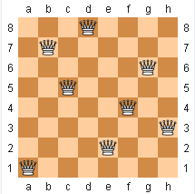

# Week5
# N個皇后問題
## 問題說明：

n 皇后問題研究的是如何將 n 個皇后放置在 n×n 的棋盤上，並且使皇后彼此之間不能相互攻擊。

給定一個整數n，返回所有不同的 n皇后問題的解決方案。

 

上圖為八皇后92種解法其中一種

## 圖片出處:[八皇后問題](https://zh.wikipedia.org/wiki/%E5%85%AB%E7%9A%87%E5%90%8E%E9%97%AE%E9%A2%98)

## [程式碼]()

```
def n_queen(k):
    global count

    for i in range(k - 1):  # 判斷是否可放置皇后的條件
        judge = queen[i] - queen[k - 1]
        if judge == 0 or abs(k - 1 - i) == abs(judge):
            return

    if k == n:
        print(queen)  # 輸出皇后放置序列
        count += 1  # 解的個數
        return

    for i in range(n):  # 放置皇后
        queen[k] = i
        n_queen(k + 1)

count = 0
n = 8  # 此處的n為幾，則為幾皇后問題
queen = [0 for _ in range(n)]
n_queen(0)
print(count)

```
## [八皇后輸出結果：](https://github.com/weng0418/ai109b/blob/main/homework/work2/8queen.txt)

```
[0, 4, 7, 5, 2, 6, 1, 3]
[0, 5, 7, 2, 6, 3, 1, 4]
[0, 6, 3, 5, 7, 1, 4, 2]
[0, 6, 4, 7, 1, 3, 5, 2]
[1, 3, 5, 7, 2, 0, 6, 4]
[1, 4, 6, 0, 2, 7, 5, 3]
[1, 4, 6, 3, 0, 7, 5, 2]
[1, 5, 0, 6, 3, 7, 2, 4]
[1, 5, 7, 2, 0, 3, 6, 4]
[1, 6, 2, 5, 7, 4, 0, 3]
[1, 6, 4, 7, 0, 3, 5, 2]
[1, 7, 5, 0, 2, 4, 6, 3]
[2, 0, 6, 4, 7, 1, 3, 5]
[2, 4, 1, 7, 0, 6, 3, 5]
[2, 4, 1, 7, 5, 3, 6, 0]
[2, 4, 6, 0, 3, 1, 7, 5]
[2, 4, 7, 3, 0, 6, 1, 5]
[2, 5, 1, 4, 7, 0, 6, 3]
[2, 5, 1, 6, 0, 3, 7, 4]
[2, 5, 1, 6, 4, 0, 7, 3]
[2, 5, 3, 0, 7, 4, 6, 1]
[2, 5, 3, 1, 7, 4, 6, 0]
[2, 5, 7, 0, 3, 6, 4, 1]
[2, 5, 7, 0, 4, 6, 1, 3]
[2, 5, 7, 1, 3, 0, 6, 4]
[2, 6, 1, 7, 4, 0, 3, 5]
[2, 6, 1, 7, 5, 3, 0, 4]
[2, 7, 3, 6, 0, 5, 1, 4]
[3, 0, 4, 7, 1, 6, 2, 5]
[3, 0, 4, 7, 5, 2, 6, 1]
[3, 1, 4, 7, 5, 0, 2, 6]
[3, 1, 6, 2, 5, 7, 0, 4]
[3, 1, 6, 2, 5, 7, 4, 0]
[3, 1, 6, 4, 0, 7, 5, 2]
[3, 1, 7, 4, 6, 0, 2, 5]
[3, 1, 7, 5, 0, 2, 4, 6]
[3, 5, 0, 4, 1, 7, 2, 6]
[3, 5, 7, 1, 6, 0, 2, 4]
[3, 5, 7, 2, 0, 6, 4, 1]
[3, 6, 0, 7, 4, 1, 5, 2]
[3, 6, 2, 7, 1, 4, 0, 5]
[3, 6, 4, 1, 5, 0, 2, 7]
[3, 6, 4, 2, 0, 5, 7, 1]
[3, 7, 0, 2, 5, 1, 6, 4]
[3, 7, 0, 4, 6, 1, 5, 2]
[3, 7, 4, 2, 0, 6, 1, 5]
[4, 0, 3, 5, 7, 1, 6, 2]
[4, 0, 7, 3, 1, 6, 2, 5]
[4, 0, 7, 5, 2, 6, 1, 3]
[4, 1, 3, 5, 7, 2, 0, 6]
[4, 1, 3, 6, 2, 7, 5, 0]
[4, 1, 5, 0, 6, 3, 7, 2]
[4, 1, 7, 0, 3, 6, 2, 5]
[4, 2, 0, 5, 7, 1, 3, 6]
[4, 2, 0, 6, 1, 7, 5, 3]
[4, 2, 7, 3, 6, 0, 5, 1]
[4, 6, 0, 2, 7, 5, 3, 1]
[4, 6, 0, 3, 1, 7, 5, 2]
[4, 6, 1, 3, 7, 0, 2, 5]
[4, 6, 1, 5, 2, 0, 3, 7]
[4, 6, 1, 5, 2, 0, 7, 3]
[4, 6, 3, 0, 2, 7, 5, 1]
[4, 7, 3, 0, 2, 5, 1, 6]
[4, 7, 3, 0, 6, 1, 5, 2]
[5, 0, 4, 1, 7, 2, 6, 3]
[5, 1, 6, 0, 2, 4, 7, 3]
[5, 1, 6, 0, 3, 7, 4, 2]
[5, 2, 0, 6, 4, 7, 1, 3]
[5, 2, 0, 7, 3, 1, 6, 4]
[5, 2, 0, 7, 4, 1, 3, 6]
[5, 2, 4, 6, 0, 3, 1, 7]
[5, 2, 4, 7, 0, 3, 1, 6]
[5, 2, 6, 1, 3, 7, 0, 4]
[5, 2, 6, 1, 7, 4, 0, 3]
[5, 2, 6, 3, 0, 7, 1, 4]
[5, 3, 0, 4, 7, 1, 6, 2]
[5, 3, 1, 7, 4, 6, 0, 2]
[5, 3, 6, 0, 2, 4, 1, 7]
[5, 3, 6, 0, 7, 1, 4, 2]
[5, 7, 1, 3, 0, 6, 4, 2]
[6, 0, 2, 7, 5, 3, 1, 4]
[6, 1, 3, 0, 7, 4, 2, 5]
[6, 1, 5, 2, 0, 3, 7, 4]
[6, 2, 0, 5, 7, 4, 1, 3]
[6, 2, 7, 1, 4, 0, 5, 3]
[6, 3, 1, 4, 7, 0, 2, 5]
[6, 3, 1, 7, 5, 0, 2, 4]
[6, 4, 2, 0, 5, 7, 1, 3]
[7, 1, 3, 0, 6, 4, 2, 5]
[7, 1, 4, 2, 0, 6, 3, 5]
[7, 2, 0, 5, 1, 4, 6, 3]
[7, 3, 0, 2, 5, 1, 6, 4]
92
```
### 八皇后總共有92種解法

## [四皇后輸出結果：](https://github.com/weng0418/ai109b/blob/main/homework/work2/4queen.txt)
```
[1, 3, 0, 2]
[2, 0, 3, 1]
2
```
### 四皇后總共有2種解法
