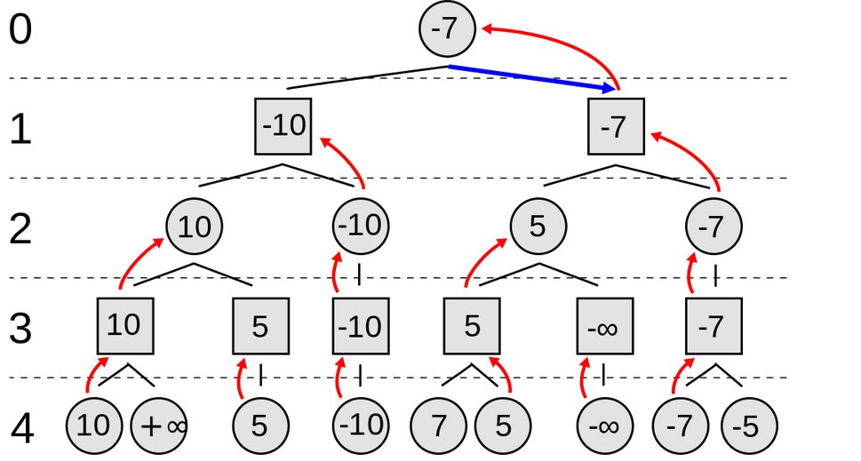

# Week8
# 電腦下棋
## AlphaGo
### 電腦要在圍棋中取勝比在西洋棋等遊戲中取勝要困難得多，因為圍棋的下棋點極多，分支因子遠多於其他遊戲，而且每次落子對情勢的好壞飄忽不定， 諸如暴力搜尋法、Alpha-beta剪枝、啟發式搜尋的傳統人工智慧方法在圍棋中很難奏效。
## 電腦下棋的關鍵： Min-Max 對局搜尋
 

## 恐怖谷理論

### 是一個關於人類對機器人和非人類物體的感覺的假設。

 
