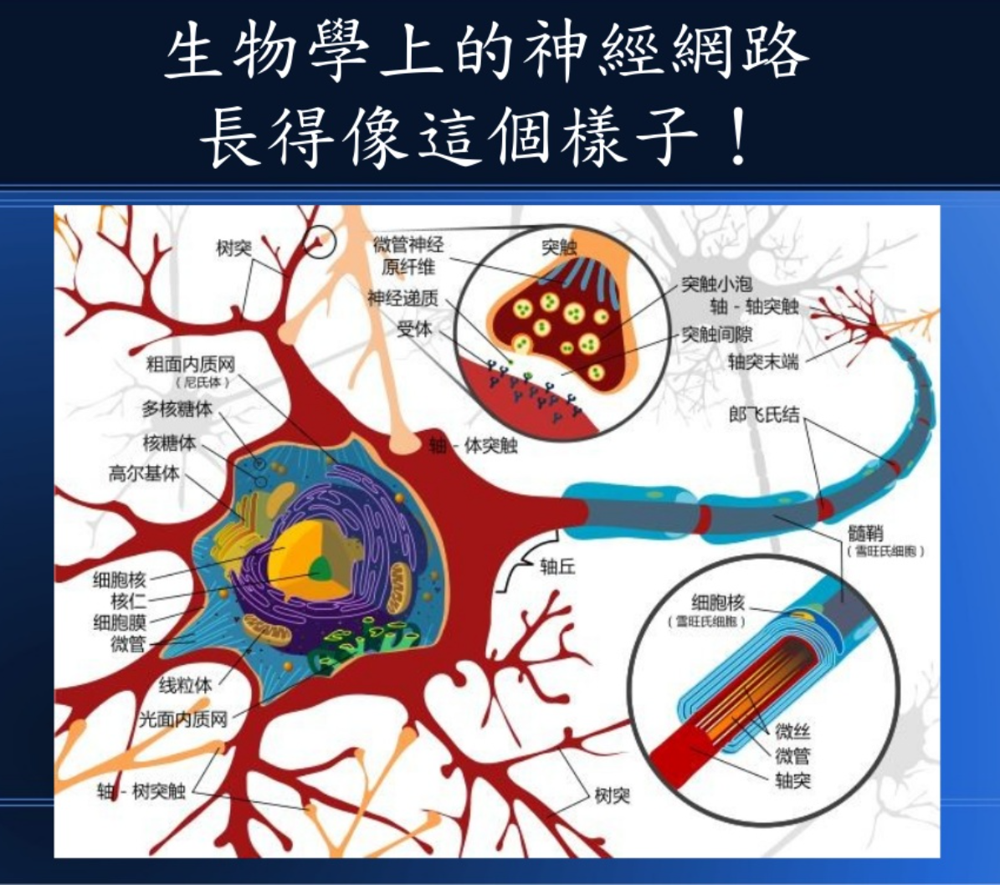
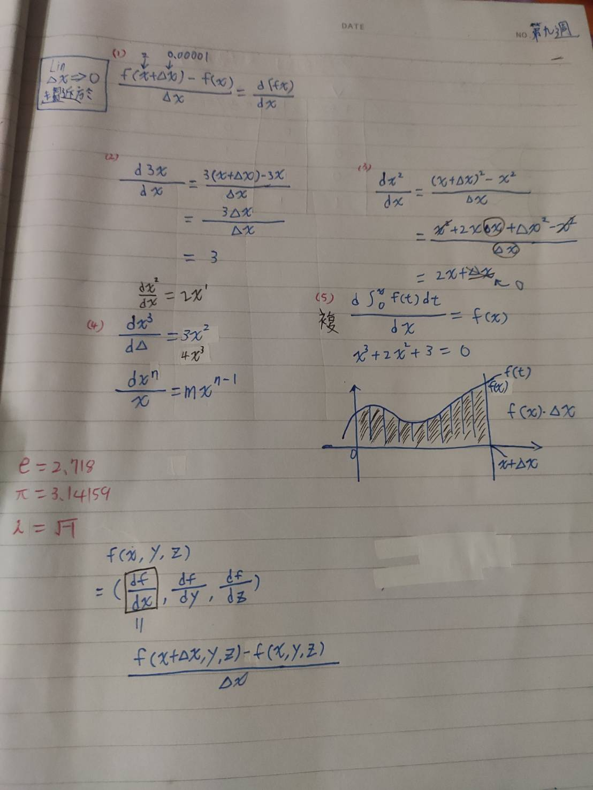
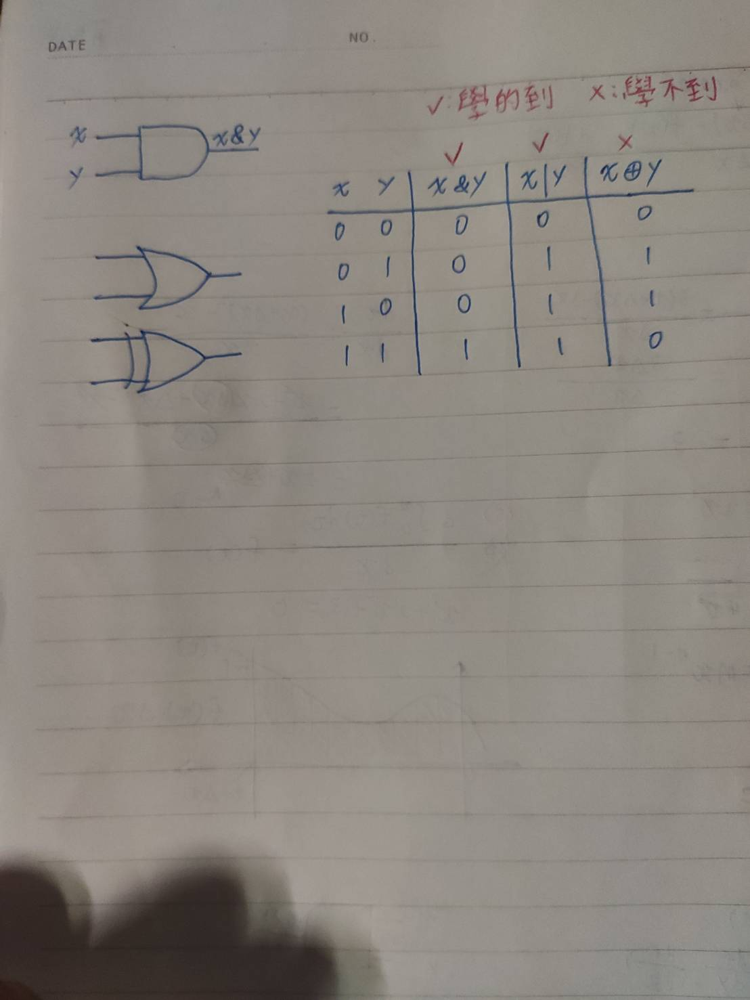

# Week9 
## 神經網路
* 在機器學習和認知科學領域，是一種模仿生物神經網路（動物的中樞神經系統，特別是大腦）的結構和功能的數學模型或計算模型，用於對函式進行估計或近似。神經網路由大量的人工神經元聯結進行計算。大多數情況下人工神經網路能在外界資訊的基礎上改變內部結構，是一種自適應系統，通俗地講就是具備學習功能。
 

# 圖片出處:[用十分鐘理解 《神經網路發展史》](https://www.slideshare.net/ccckmit/ss-69447809)

## 梯度下降法
* 是一個一階最佳化算法，通常也稱為最陡下降法，但是不該與近似積分的最陡下降法（英語：Method of steepest descent）混淆。 要使用梯度下降法找到一個函數的局部極小值，必須向函數上當前點對應梯度（或者是近似梯度）的反方向的規定步長距離點進行疊代搜索。如果相反地向梯度正方向疊代進行搜索，則會接近函數的局部極大值點；這個過程則被稱為梯度上升法。
### 缺點:
* 靠近局部極小值時速度減慢。
* 直線搜索可能會產生一些問題。
* 可能會「之字型」地下降。

# 補充內容
 
 
